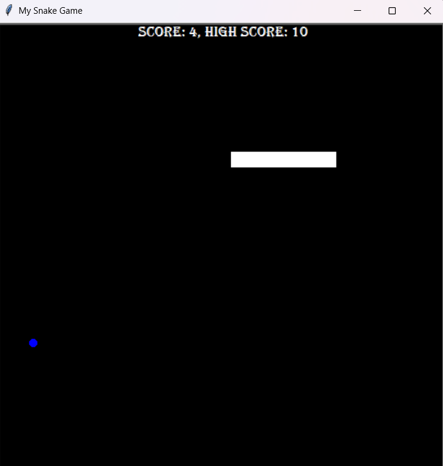

# 🐍 SNAKE GAME

* A classic Snake game built using Python's turtle module. Guide the snake to eat food, grow longer, and avoid collisions with the walls or itself!

## 🎮 Features
* Responsive snake controlled with arrow keys.

* Food randomly appears on the screen — eat it to grow longer.

* Scoreboard tracks your progress.

* Collision with walls or the snake’s own body resets the game.

* Smooth animations and clean UI using turtle graphics.

## 🧠 Game Logic
* __Snake Movement__: Controlled by arrow keys with directional functions (up, down, left, right).

* __Food Collision__: When the snake's head comes close to the food, the snake grows and the food relocates.

* __Wall Collision__: If the snake hits any edge of the window, the score resets and the snake resets.

* __Tail Collision__: If the snake collides with its own body, the game resets.

* __Score System__: Tracks current score and resets on collision events.

## 🕹️ Controls
* ↑ Up Arrow – Move up

* ↓ Down Arrow – Move down

* ← Left Arrow – Move left

* → Right Arrow – Move right

## 📁 File Structure
* __main.py__ – Main game loop and screen setup

* __snake.py__ – Contains the Snake class: creation, movement, and growth

* __food.py__ – Contains the Food class: positioning and refreshing the food

* __scoreboard.py__ – Contains the ScoreBoard class: displays and resets score

## 📝 Requirements
* Python 3.x

* Uses Python's built-in turtle and time modules — no external libraries required.

## ▶️ How to Run
* Ensure all necessary files (main.py, snake.py, food.py, scoreboard.py) are in the same folder.

* Open a terminal or command prompt in that folder.

* Run the game using:

   * ``` python main.py ```

* Use arrow keys to control the snake. Try to get the highest score you can!

## 📸 Gameplay Snapshot 


